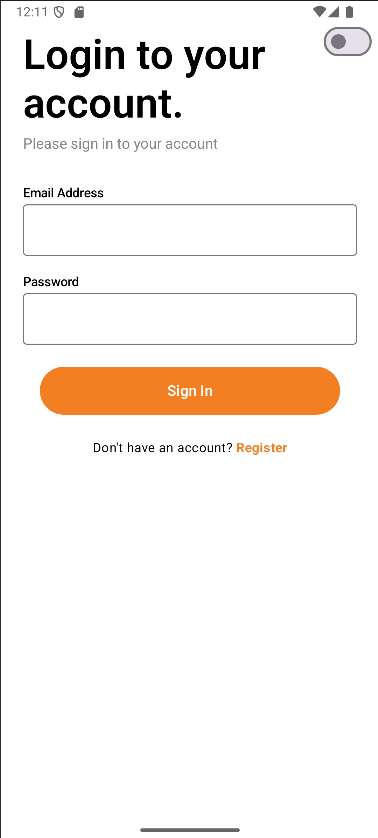

# Fast Delivery

**Fast Delivery** is a food delivery eCommerce Android app built with **Kotlin**, **Jetpack Compose**, and **MVVM architecture**.  
It allows users to browse food products by category, search by name, add items to a cart, place orders, and manage their profile, including editing their information and uploading a profile picture.

---

##  Features

-  User login and registration (via external API)
-  Home screen with product categories
-  Search products by name
-  Add products to cart
-  Submit orders from cart
-  View past orders in user profile
-  Editable user profile with full name, nationality, email
-  Upload profile picture via **camera or gallery** (stored in **Cloudinary**)
-  Full support for **dark mode** and **light mode**

---

## Screenshots

### Welcome Screen


### Register Screen


### Login Screen


### Home Screen


### Search Screen


### Cart Screen


### Profile Screen


### Profile Preview Screen


### Edit Profile


### Orders


### Orders confirmation


## Tech Stack

- **Language:** Kotlin
- **UI:** Jetpack Compose
- **Architecture:** MVVM
- **Dependency Injection:** Hilt
- **Networking:** Retrofit + Gson
- **Local Storage:** Room
- **Remote Database:** MongoDB (via backend on Render)
- **Image Hosting:** Cloudinary
- **Testing:** JUnit4, MockK, Coroutine test support (MainDispatcherRule)

---

## Project Structure

```
com.example.fastdelivery
├── auth               # Authentication (login, register, auth state)
├── cart               # Cart logic (add/remove items, view cart)
├── components         # Reusable Jetpack Compose UI components
├── di                 # Dependency Injection (Hilt modules)
├── home.presentation  # Home screen logic and UI (category filters, search)
├── navigation         # Navigation routes and NavGraph setup
├── order              # Order creation, submission and history
├── product            # Product listing, details and data layer
├── profile            # Editable user profile with Room + Cloudinary
├── ui.theme           # App theme configuration (light/dark mode)
```

## 🔌 API & Image Upload

- **API Base URL:** [https://peya-delivery-api.onrender.com/](https://peya-delivery-api.onrender.com/)
- **Backend:** Node.js + Express + MongoDB (hosted on Render)
- **Profile Editing:**
    - Editable fields: full name, nationality, email
    - Profile picture is uploaded to **Cloudinary**
    - Alert dialog allows the user to choose between:
        -  Take photo with camera
        -  Select from gallery
    - Runtime permissions handled dynamically

---

##  Testing

The app includes unit tests for core modules using:

- `JUnit4`
- `MockK`
- `MainDispatcherRule` for coroutine support

Tested modules:

- `auth`
- `cart`
- `order`
- `product`
- `profile`
- `utils`

---

## 🛠️ Installation

```bash
git clone https://github.com/your_username/fast-delivery.git
